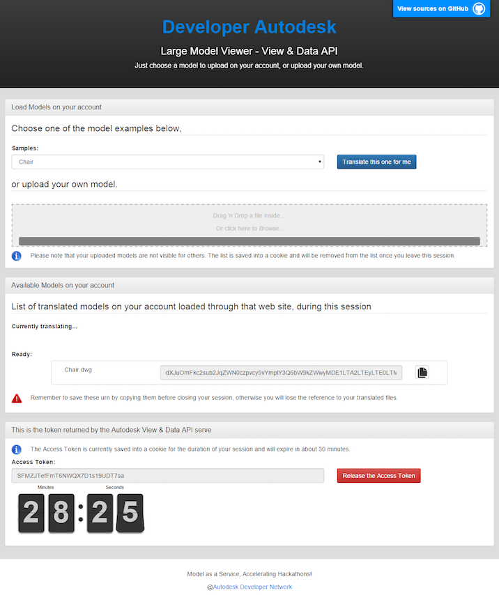

# models.autodesk.io sample

[](https://travis-ci.org/cyrillef/models.autodesk.io)
[](https://nodejs.org/)
[](https://www.npmjs.com/)
[](http://developer-autodesk.github.io/)

[](http://opensource.org/licenses/MIT)


*Forge API*:
[](http://developer-autodesk.github.io/)
[](http://developer-autodesk.github.io/)
[](http://developer-autodesk.github.io/)
[](http://developer-autodesk.github.io/)
[](http://developer-autodesk.github.io/)


<b>Note:</b> For hosting this sample, you do not need any credentials. But anyone using the sample will need
valid credentials for the upload /translation process. Visit [the Forge WEB site](https://developer.autodesk.com) for
instructions to get on-board.


## Live demo at
https://models.autodesk.io/

[](https://models.autodesk.io/)


## Description

This sample exercises and demonstrates the Autodesk Forge API authorization, and translation process
mentioned in the Quick Start guide. It provides you a quick way to get file ready for viewing on your own account
without programming.


## Dependencies

This sample is dependent of Node.js and few Node.js extensions which would update/install automatically via 'npm'.

1. Node.js - built on Chrome's JavaScript runtime for easily building fast, scalable network applications.
   You can get Node.js from [here](http://nodejs.org/)

This sample is also dependent on the client side on couple of javascript library which are installed
along this sample:

2. filedrop.js - A Self-contained cross-browser HTML5, legacy, AJAX, drag & drop JavaScript file upload, available [here](http://filedropjs.org/).

3. flipclock.js - A flip clock javascript library, available [here](http://flipclockjs.com/).

4. zeroclipboard.js - A library which provides an easy way to copy text to the clipboard using an invisible Adobe Flash movie and a JavaScript interface,
   available [here](http://zeroclipboard.org/).


## Setup/Usage Instructions

The sample was created using Node.js and javascript.


### Deploy on Heroku

[](https://heroku.com/deploy)


<a name="setupSample"></a>
### Setup
1. Download and install [Node.js](http://nodejs.org/) (that will install npm as well)
2. Download this repo anywhere you want (the server will need to write files, so make sure you install in
   a location where you have write permission, at least the 'uploads' folder)
3. Execute 'npm install', this command will download and install the required node modules automatically for you.<br />
   ```
   npm install
   ```
4. You are done for the setup, launch the node server using the command '[sudo] node start.js'.
   sudo is required only on OSX and Linux.<br />
   * Windows<br />
   ```
   [set PORT=<port>]
   node start.js
   ```
   * OSX/Linux<br />
   ```
   sudo [PORT=<port>] node start.js
   ```
   <br />
   <b>Note:</b> the port argument can be omitted and default to port 3000. If port 3000 is already in use by another
   application, you can use any other free port. But in the next section you would need to specify the port to
   use, i.e. http://localhost[:port]/


<a name="UseOfTheSample"></a>
### Use of the sample

Translating files

1. Start your favorite browser supporting HTML5 and WEBGL and browse to http://localhost:3000/.<br />
   <b>Note:</b> In case you use a different port above do not forget to include it in the URL. I.e.
   http://localhost:8000/.
2. Drag'n Drop your files into the 'Drop area' or browse for individual files, That's it.<br />
   Or choose one of the proposed sample from the Dropbox and click on teh the 'Translate this one for me'.
3. After the translation completed successfully, you can copy the encoded urn string that you can use to view the
   results, in a html page which supports the Autodesk viewer.
4. You are done with translation.


--------

## License

This sample is licensed under the terms of the [MIT License](http://opensource.org/licenses/MIT). Please see the [LICENSE](LICENSE) file for full details.


## Written by

Cyrille Fauvel <br />
Forge Partner Development <br />
http://developer.autodesk.com/ <br />
http://around-the-corner.typepad.com <br />
